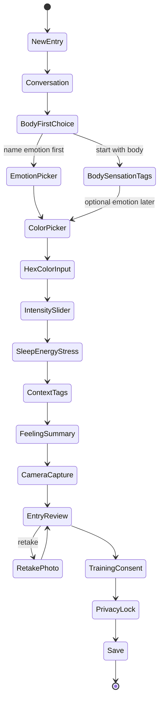

# CIRCE System Architecture

## Overview

CIRCE runs as a **custom application layer** on SenseCAP Watcher factory firmware patterns (ESP-IDF + LVGL + BSP). It is a structured journaling and reflection tool, not a replacement for the Watcher's AI surveillance task flows.

```
┌─────────────────────────────────────────────────────────────┐
│                     Circe Application                        │
│  ┌─────────────┐  ┌──────────────┐  ┌─────────────────────┐ │
│  │ circe_      │  │ Entry Flow   │  │ pattern_reflection  │ │
│  │ assistant   │  │ Orchestrator │  │ _engine (local)     │ │
│  └──────┬──────┘  └──────┬───────┘  └──────────┬──────────┘ │
│         │                │                        │           │
│  ┌──────┴────────────────┴────────────────────────┴──────┐  │
│  │              UI Modules (LVGL / SquareLine)            │  │
│  └──────────────────────────┬─────────────────────────────┘  │
│  ┌──────────────────────────┴─────────────────────────────┐  │
│  │ local_storage │ sync_queue │ export_dataset (opt-in)    │  │
│  └──────────────────────────┬─────────────────────────────┘  │
└─────────────────────────────┼────────────────────────────────┘
                              │
┌─────────────────────────────┴────────────────────────────────┐
│ SenseCAP Watcher BSP (sensecap-watcher, lvgl, touch, knob)   │
│ ESP32-S3 │ Display │ Camera │ Audio │ microSD │ Wi-Fi/BLE   │
└──────────────────────────────────────────────────────────────┘
                              │
              (future, opt-in LAN only)
                              │
        ┌─────────────────────┼─────────────────────┐
        ▼                     ▼                     ▼
  Magic Mirror           Hades Watch          Local GPU
  (visualization)        (inference/memory)   (batch training)
```

---

## Architectural principles

1. **Offline-first** — Full entry flow works without network.
2. **Body-first routing** — Flow orchestrator supports skipping emotion picker until ready.
3. **Append-only journal** — Entries are versioned; delete is explicit (`delete_entry`).
4. **Privacy gates** — `training_ok` and `private_locked` enforced at storage and export layers.
5. **Thin Watcher, thick LAN** — Watcher collects; heavy ML/visualization on Hades/GPU later.

---

## Layer responsibilities

| Layer | Responsibility |
|-------|----------------|
| **circe_assistant** | Conversational prompts, flow guidance, copy |
| **Entry flow orchestrator** | State machine for user flow steps |
| **UI modules** | One LVGL screen/widget set per step |
| **local_storage** | Persist entries, photos, favorites on microSD |
| **sync_queue** | Outbound LAN sync jobs (disabled by default) |
| **pattern_reflection_engine** | On-device lightweight stats (counts, streaks, correlations) |
| **export_dataset** | User-initiated, consent-gated export for training |
| **calibration_mode** | User tuning of sliders, favorites, body map sensitivity |

---

## Entry flow state machine

Primary path matches product spec; alternate **body-first** path shown.



Any state may transition to **Save (partial)** if user chooses "save privately" shortcut — stored with `completion_status: partial`.

---

## Data flow

1. UI module collects field values → in-memory `EntryDraft`.
2. `entry_review` presents read-only summary.
3. On save: `local_storage` writes JSON record + optional JPEG to microSD.
4. If `training_ok && !private_locked`: entry ID eligible for `export_dataset` queue.
5. `mood_strand_visualizer` reads color records for timeline UI.
6. `sync_queue` (future) pushes non-private aggregates to Magic Mirror API.

---

## Technology choices (Phase 2 proposals)

| Concern | Recommendation | Rationale |
|---------|----------------|-----------|
| Persistence | JSON lines or SQLite on FAT32 | SQLite simplifies queries; JSON simpler to debug — **decision needed** |
| Photos | JPEG files + path in entry record | Matches Himax output format |
| UI tool | SquareLine Studio | Official Watcher workflow |
| Config | NVS for settings; SD for entries | Preserve `nvsfactory` |
| Sync transport | HTTPS or MQTT on LAN | Match home infra |

---

## Non-goals (Phase 1–2)

- Cloud SenseCraft dependency for core features
- On-device LLM
- Real-time emotion classification
- Automatic photo analysis

---

## Related documents

- [Module map](module-map.md)
- [Data flow detail](data-flow.md)
- [User flow](../design/user-flow.md)
- [Entry schema](../schema/entry-schema.md)
- [Privacy model](../design/privacy-model.md)
