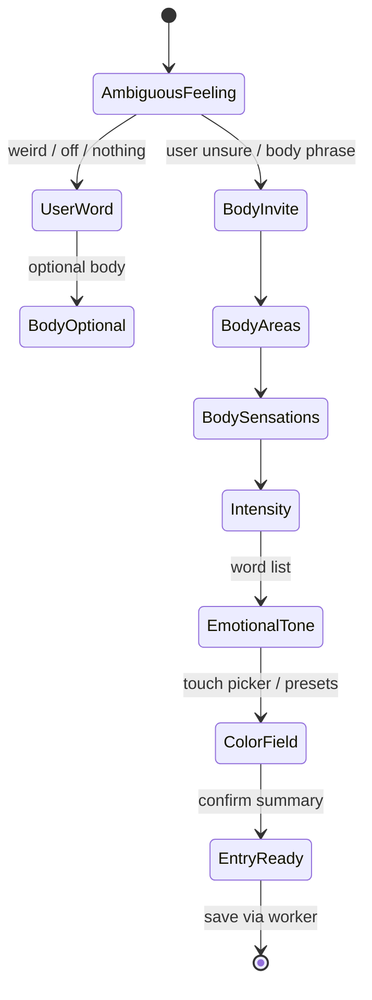

# Circe — Body-First Flow

When the user **cannot name an emotion**, Circe starts with the body. These flows are **first-class**, not fallbacks.

Related: [body-sensation-system.md](../design/body-sensation-system.md), [CIRCE_CONVERSATION_PATTERNS.md](CIRCE_CONVERSATION_PATTERNS.md)

---

## Core principle

> "I don't know the emotion yet, but my body feels like this."

Circe never blocks progress on missing emotion. She offers body, color, or save at every ambiguous turn.

---

## Entry phrases → Circe responses

### "I don't know what I feel."

**Circe:** "Not knowing is okay. Body sensations are often clearer than emotion words."

**Path A — Body**

1. "Tap where something feels noticeable."
2. Sensation chips.
3. "Want a color for this, or save body-only?"

**Path B — Color skip**

User: **Just save what I can**

**Circe:** "We can save with body tags only, or even just a color. What feels possible?"

Buttons: **Body** | **Color only** | **Save empty moment**

**Never:** "Try to identify your emotion."

---

### "I feel weird."

**Circe:** "Weird is a valid word. Want to stay with that, or look at your body?"

Buttons: **Keep "weird" as my word** | **Body first** | **Color**

If **Keep "weird"**:

- Set `emotion: "weird"` (user word, not Circe's diagnosis)
- "Where does weird live in your body, if anywhere?"

Buttons: **Body map** | **Skip body** | **Continue**

If **Body first**:

- Standard body flow; emotion field stays null unless user adds "weird" later.

---

### "I feel off."

**Circe:** "Off — I hear that. Sometimes off shows up in the body before it has a name."

Buttons: **Start with body** | **Pick a color for 'off'** | **Not sure**

**Color path:**

**Circe:** "If 'off' had a color today, what would it be?"

No requirement to explain what "off" means.

---

### "My body feels wrong."

**Circe:** "That sounds uncomfortable. You don't have to explain. Where feels wrong?"

→ Body area map (emphasize **whole body**, **skin**, **stomach** if user scrolls)

**After areas selected:**

**Circe:** "What quality — heavy, numb, buzzing, something else?"

**If user selects `pain_spike` or `numb`:**

**Circe:** "I'll keep this private unless you change that. Save when ready."

Do not ask "what caused it."

---

### "I feel nothing."

**Circe:** "Nothing is something too — flat, empty, or quiet. Does any of that fit?"

Sensation suggestions (non-pressuring chips):

- `numb`
- `floaty`
- `heavy`
- **None of these — literally blank**

If **literally blank**:

**Circe:** "Blank moment. Want a color anyway — gray, white, black — or save with no tags?"

| Option | Entry result |
|--------|--------------|
| Gray default `#808080` | color-only entry |
| Save with empty arrays | valid partial entry |
| Add `whole_body` + `numb` | user choice |

**Never:** "You must feel something."

---

## Flow diagram (body-first master)



---

REGULATE opens grounding / breathing / body anchor tools (see [GROUNDING_BREATHING_MVP.md](../regulation/GROUNDING_BREATHING_MVP.md)).

---

## Step-by-step: canonical body-first session

| Step | Circe | User action | Data |
|------|-------|-------------|------|
| 1 | "How are you arriving?" | Tap **Body first** | `flow_path: body_first` |
| 2 | "Tap where you notice something." | Select areas | `body_areas[]` |
| 3 | "What quality?" | Select sensations or **Nothing** | `body_sensations[]` |
| 4 | "Choose a word, or skip." | Tone list or SKIP | `emotion`, `emotion_label`, `emotional_tone` |
| 5 | "Drag to choose the color of this moment." | Touch field / PRESETS / SKIP | `color_hex`, `color_label`, `color_source` |
| 6 | "Entry ready." | SAVE or change tone/color | confirm |
| 7 | "Saved privately." | Review / HOME | — |

Target time: **30–90 seconds** to save after step 3.

---

## Circe lines — quick reference table

| User says | Circe opens with |
|-----------|------------------|
| I don't know what I feel | Not knowing is okay. Body first? |
| I feel weird | Weird is valid. Body, or keep weird as your word? |
| I feel off | Off shows up in the body sometimes. Body or color? |
| My body feels wrong | You don't have to explain. Where feels wrong? |
| I feel nothing | Nothing counts. Numb, flat, or blank? |

---

## Save shortcuts (body-first)

Available after step 3 (sensations):

**Circe:** "Enough for now?"

Buttons: **Save privately** | **Add color** | **Keep going**

Sets `completion_status: partial` if ratings/photo skipped — **valid success state**.

---

## Review copy (body-first)

**Display (terminal feed):**

```
body chest / tight / 9
tone OVERWHELMED
color CUSTOM #8A4DFF
```

Tone and color are separate lines. If skipped: `tone UNKNOWN` or `color SKIPPED`.

See [EMOTION_COLOR_FLOW_SPLIT.md](../design/EMOTION_COLOR_FLOW_SPLIT.md).

---

## Firmware notes

- `flow_path = body_first` when user chooses body at check-in OR uses ambiguous phrase buttons on greeting screen.
- Greeting screen should expose **phrase chips** for the five scenarios above (icon + short label).
- Emotion tone step (`CIRCE_FLOW_EMOTION_TONE`) is separate from color picker (`CIRCE_FLOW_COLOR_PICKER`).
- Quick Entry skips tone + touch picker; uses preset color defaults.

---

## Copy polish (2026-06-24)

On-device prompts now use `circe_copy.c` keys:

| Step | Key | Phrase |
|------|-----|--------|
| Body area | `body.area_prompt` | Where is your body speaking? |
| Sensation | `body.sensation_prompt` | What does that area feel like? |
| Intensity | `body.intensity_prompt` | How strong is the signal? A rough answer is enough. |
| Tone | `tone.prompt` | Choose a word, or skip. |
| Tone subline | `tone.rough_ok` | A rough word is enough. |

See `docs/conversation/CONVERSATION_ENGINE_COPY_POLISH.md`.
