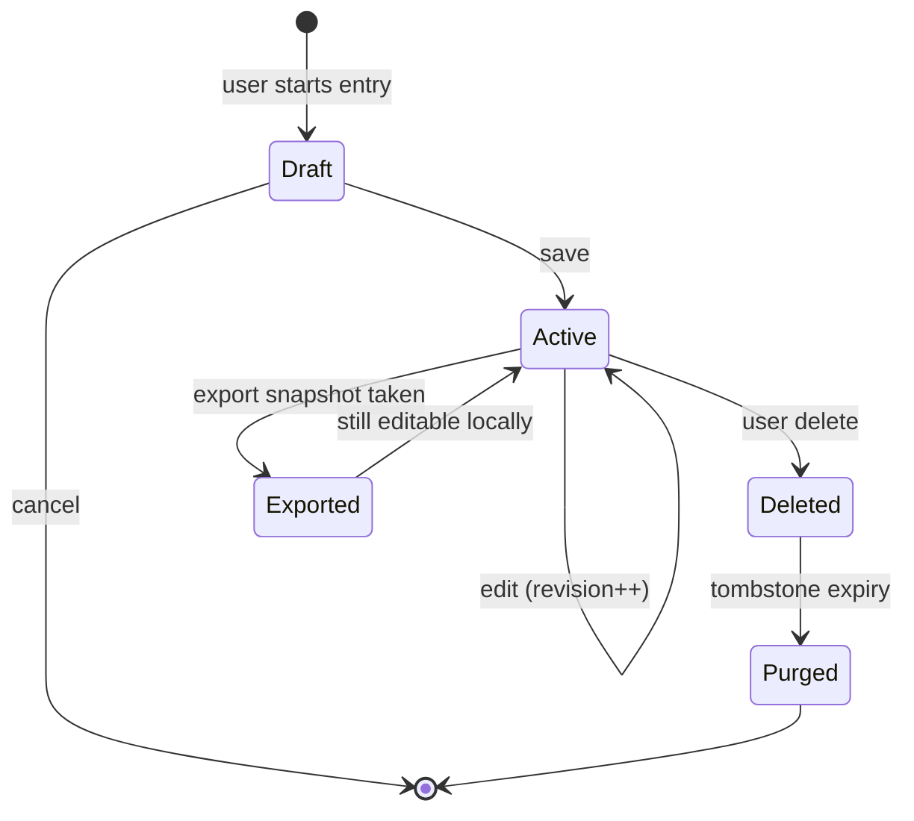

# Entry Lifecycle

Complete lifecycle for every `EmotionEntry` from creation through training eligibility.

Related: [privacy-model.md](../design/privacy-model.md), [MEMORY_ARCHITECTURE.md](MEMORY_ARCHITECTURE.md)

---

## Identity

Each entry has immutable **`id`** (UUID v4). Lifecycle events reference this id.

Optional **`revision`** field (see SCHEMA_ADDITIONS) — edits create new revision chain; latest is current.

---

## 1. Creation

### Trigger

User completes save flow (any `entry_mode`).

### Steps

1. Validate against `emotion-entry.schema.json` (+ extensions)
2. Assign `id`, `created_at` (UTC), `device_id`
3. Apply defaults: `training_ok=false`, `private_locked=true`
4. Write canonical JSON: `entries/YYYY-MM-DD/<uuid>.json` (atomic temp → rename)
5. Insert SQLite index row
6. Append to sync queue **only if** `!private_locked && sync_enabled`
7. Trigger daily rollup job (async)
8. Delete short-term draft

### Initial state flags

| Field | Value |
|-------|-------|
| `lifecycle_state` | `active` |
| `deleted_at` | null |
| `exported_at` | null |
| `sync_status` | `local_only` or `queued` |

### Circe

"Saved privately." / "Thank you for checking in."

---

## 2. Editing

### Policy

- User may edit from **entry review** (future history browser)
- Edit creates **`revision + 1`**; prior revision retained for audit (user setting: keep history default ON)
- **`created_at` immutable**; `updated_at` set
- Privacy/training flags may change on edit — user must confirm if loosening privacy

### Steps

1. Load current revision JSON
2. User modifies fields in UI
3. Write `entries/YYYY-MM-DD/<uuid>.rev<N>.json` OR overwrite with `revision` increment (config: `edit_history_mode: chain | overwrite`)
4. Update SQLite index
5. If photo changed: old photo moved to `photos/_trash/` until compaction
6. Recompute rollups for affected dates
7. If previously synced: queue **update** or **delete+resync** (Mirror policy)

### Training impact

- If `training_ok` turned **off**: entry removed from export eligibility lists; Hades must not use in future exports
- If turned **on**: eligible only for **future** exports — not retroactive auto-upload

### Constraints

- Cannot edit another device's entry id
- Cannot edit `device_id`

---

## 3. Deletion

### User-initiated hard delete

1. Confirmation: "Delete this entry permanently?"
2. Move JSON to `entries/_deleted/<uuid>.json.tombstone` (optional 30-day undo buffer — user setting)
3. Delete or quarantine photo/voice sidecars
4. Remove SQLite index row
5. Remove from sync queue; send **delete** event to Mirror if was synced
6. Recompute rollups
7. Remove from export manifests if not yet shipped

### Tombstone record (optional)

```json
{
  "id": "uuid",
  "deleted_at": "2026-06-24T20:00:00Z",
  "purge_after": "2026-07-24T20:00:00Z"
}
```

After `purge_after`: secure wipe file clusters (best effort on FAT).

### Circe

"Deleted. It won't appear in your strand."

Never guilt language.

---

## 4. Export

### Eligibility

Entry included in export bundle **iff**:

```
training_ok == true
AND private_locked == false
AND lifecycle_state == active
AND user confirms export dialog
```

Optional export filters: date range, entry_mode, includes_photos, includes_voice.

### Steps

1. User: Settings → Export dataset → choose filters
2. Scan index with eligibility predicate
3. Write `export/circe-export-<timestamp>/manifest.json`
4. Write `entries.jsonl` (one line per entry, anonymized `device_id`)
5. Copy consented photos to `photos/` subfolder
6. Copy consented voice to `voice/` subfolder
7. SHA256 manifest of bundle
8. Set `exported_at` on entries (metadata only — does not imply ongoing sharing)

### Re-export

Same entry may appear in multiple export bundles (versioned manifests). Hades dedupes by entry `id`.

### Circe

"This export includes N entries you allowed. Nothing leaves unless you copy it."

---

## 5. Sync (Magic Mirror / LAN)

### Eligibility

```
private_locked == false
AND sync_enabled globally
AND lifecycle_state == active
```

`training_ok` **not required** for Mirror sync (visualization ≠ training).

Photos: separate `photo_sync_allowed` global gate.

### States

| sync_status | Meaning |
|-------------|---------|
| `local_only` | Default |
| `queued` | Pending LAN push |
| `synced` | Acknowledged by Mirror |
| `failed` | Retry with backoff |
| `delete_pending` | Tombstone propagating |

### Payload

Minimal **StrandSegment** + optional summary — not full journal unless user enables "sync full entries" (off by default).

### Circe

No automatic sync notification unless user enables audit log.

---

## 6. Training eligibility

### Gates (all required)

| Gate | Field |
|------|-------|
| Per-entry consent | `training_ok == true` |
| Not private | `private_locked == false` |
| Active | `lifecycle_state == active` |
| User export action | export bundle created |
| Modality consent | photo/voice flags in sidecar |

### Lifecycle after export

- Entry remains on Watcher unchanged
- Hades ingests copy — **Watcher is still source of truth**
- Model training does not mutate Watcher storage
- User deletes entry on Watcher → export copies on Hades become orphaned (Hades purge policy separate)

### Embeddings (future)

Stored on Hades keyed by `entry_id`. Watcher stores optional `embedding_ref` null or opaque id — **not** the vector.

---

## State machine



---

## Audit log (optional user setting)

Append-only `logs/lifecycle.jsonl`:

```json
{"at":"...","event":"entry.created","id":"..."}
{"at":"...","event":"entry.exported","id":"...","bundle":"..."}
```

Never synced by default.

---

## Related modules

- `local_storage` — canonical write
- `delete_entry` — delete flow
- `export_dataset` — export job
- `sync_queue` — LAN sync
- `training_consent_toggle`, `privacy_lock` — flags at create/edit
