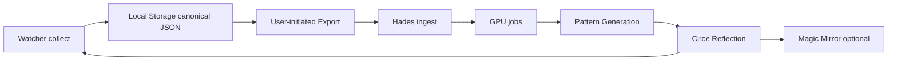

# GPU Pipeline Plan

Design for: **Watcher → Local Storage → Export → GPU Processing → Pattern Generation → Circe Reflection**

**No implementation** — architecture and data contracts only.

Related: [training-dataset-design.md](../ml/training-dataset-design.md), [PATTERN_DISCOVERY_DATA_MODEL.md](PATTERN_DISCOVERY_DATA_MODEL.md)

---

## Pipeline overview



**One-way default:** Reflections/suggestions return to Watcher; trained weights stay on Hades unless user opts into on-device models (out of scope v1).

---

## Stage 1 — Watcher (collect)

| Output | Format |
|--------|--------|
| EmotionEntry JSON | `entries/YYYY-MM-DD/<uuid>.json` |
| Photos | JPEG sidecars |
| Voice | WAV + transcript (future) |
| Index | SQLite |

No GPU on Watcher. No automatic export.

---

## Stage 2 — Local storage

Canonical truth on microSD. See [STORAGE_DECISION_STUDY.md](STORAGE_DECISION_STUDY.md).

Eligibility predicate for export:

```sql
SELECT id FROM entry_index
WHERE training_ok = 1
  AND private_locked = 0
  AND lifecycle_state = 'active'
```

---

## Stage 3 — Export (user gate)

User action: Settings → Export to Hades / Save to SD export folder.

### Bundle structure

```
circe-export-<timestamp>/
  manifest.json
  entries.jsonl
  photos/          # optional
  voice/           # optional
  rollups/         # optional daily summaries
  checksums.sha256
  README.txt
```

### Transfer methods

| Method | Path |
|--------|------|
| SD card physical | User moves export folder to Hades |
| LAN SCP/HTTPS | Watcher or PC pushes to Hades inbox |
| NAS drop | Export to NAS; Hades watches inbox |

No cloud.

---

## Stage 4 — Hades ingest

### Ingest service (future)

1. Validate manifest + schema versions
2. Verify checksums
3. Dedupe by `entry_id`
4. Store in Hades dataset store (PostgreSQL/SQLite/files — Hades choice)
5. Queue GPU jobs per manifest flags

### manifest.json extensions

```json
{
  "schema_version": "1.0.0",
  "export_profile": "labels_only | full_consented",
  "includes_photos": true,
  "includes_voice": false,
  "includes_embeddings_request": true,
  "device_id_hash": "sha256:salt:...",
  "entry_count": 42,
  "circe_export_version": "1.0.0"
}
```

---

## Stage 5 — GPU processing

### Job types (parallelizable)

| Job | Input | Output |
|-----|-------|--------|
| `embed_photo` | JPEG | vision embedding vectors |
| `embed_voice` | WAV | speech embedding vectors |
| `embed_multimodal` | entry JSON + media | fused vector |
| `cluster_entries` | embeddings | cluster_id → entry_ids |
| `correlate_ratings` | time series | PatternObservation JSON |
| `suggest_color` | body tags | suggested hex (low confidence) |
| `fine_tune_assist` | consented corpus | LoRA adapter (optional) |

All outputs tagged with `model_version` and `generated_at`.

---

## Stage 6 — Pattern generation

Hades writes **PatternObservation** files matching [PATTERN_DISCOVERY_DATA_MODEL.md](PATTERN_DISCOVERY_DATA_MODEL.md).

Deliver to Watcher:

```
GET /circe/patterns?since=<timestamp>
→ { "observations": [...], "suggestions": [...] }
```

Watcher stores in `patterns/imported/` — **cache**, not canonical.

On-device rule-based patterns still run without Hades; GPU enriches when available.

---

## Stage 7 — Circe reflection

### Suggestion packet (Hades → Watcher)

```json
{
  "suggestion_id": "sug-uuid",
  "entry_id_context": null,
  "type": "color_suggestion | pattern_offer | neighbor_entry",
  "display_key": "pattern.color_cluster",
  "payload": { "hex": "#4A5568" },
  "confidence": "low",
  "disclaimer_key": "suggestion_not_diagnosis",
  "expires_at": "2026-07-01T00:00:00Z"
}
```

### Watcher behavior

- Show in Circe voice using template keys
- User **accept** → may prefill color picker
- User **dismiss** → suppress similar 14 days
- **Never** auto-write to journal

---

## Failure modes

| Failure | Behavior |
|---------|----------|
| Export interrupted | Resume from checksum manifest |
| Hades offline | Watcher uses local pattern rules only |
| GPU OOM | Queue retry; no Watcher impact |
| Model version drift | Watcher ignores unsupported suggestion types |

---

## Security

- TLS on LAN
- Export encrypted optional (see EXPORT_AND_BACKUP_STRATEGY)
- Hades never pulls from Watcher — **push or SD only**

---

## Phase rollout

| Phase | Capability |
|-------|------------|
| 2 | Local storage only |
| 3 | Manual SD export JSONL |
| 4 | Hades ingest + rule patterns |
| 5 | GPU embeddings + suggestions |
| 6 | Mirror reflects GPU aggregates (non-private) |
